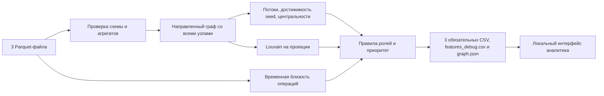

# Граф денег

Локальный инструмент AML-аналитика: направленный граф переводов, объяснимые ролевые гипотезы, кластеры и приоритет проверки. Данные не отправляются внешним сервисам. Исходный код организаторов сохранён в `starter/`.

## Запуск

Нужен Python ≥3.12. Проверено на Python 3.12.5 и macOS. Python 3.14.1 исключён из поддерживаемых версий NetworkX в текущем `requirements.txt`.

Первый запуск на macOS/Linux из корня репозитория:

```bash
python3 -m venv .venv && .venv/bin/python -m pip install -r requirements.txt && .venv/bin/python app.py
```

Откройте **http://127.0.0.1:8000**. Остановка: Ctrl+C. Интернет нужен для первоначальной установки зависимостей; затем расчёт и интерфейс работают без сети. Сервер доступен только на локальном адресе.

Повторный запуск с полным пересчётом:

```bash
.venv/bin/python app.py
```

Только расчёт, без сервера:

```bash
.venv/bin/python pipeline.py --data data --out output
```

Другой порт: `.venv/bin/python app.py --port 8001`. При каждом запуске сервер пересчитывает данные; откройте адрес после появления сообщения «Граф денег: http://127.0.0.1:…».

Для Windows PowerShell:

```powershell
py -3.12 -m venv .venv
.\.venv\Scripts\python.exe -m pip install -r requirements.txt
.\.venv\Scripts\python.exe app.py
```

В остальных командах ниже на Windows используйте `.\.venv\Scripts\python.exe` вместо `.venv/bin/python`.

## Вход и выход

Ожидаются `data/nodes.parquet` (`gid, depth, is_seed`), `data/edges.parquet` (`src, dst, sum_kzt, n_tx, depth`) и `data/transactions.parquet` (`src, dst, date, sum_kzt`). Проверяются обязательные поля, пропуски, уникальность узлов и пар рёбер, существование контрагентов, положительность сумм и совпадение рёбер с транзакциями по парам, суммам и количеству.

| Файл | Содержание |
|---|---|
| `output/nodes_roles.csv` | Все узлы, включая изолированные; строго шесть колонок в порядке `gid, role, role_score, cluster_id, priority_score, evidence` |
| `output/features_debug.csv` | `gid` и все остальные аналитические признаки: глубина, seed, потоки, центральности, ограничения наблюдения и `role_rule` |
| `output/clusters.csv` | `cluster_id, n_nodes, n_seed, sum_kzt_internal, top_gids, hypothesis` |
| `output/top_nodes.csv` | Топ-50 среди ролей кроме peripheral (или все подходящие узлы, если их меньше): `rank, gid, role, priority_score, why` |
| `output/graph.json` | Результаты, связи с отдельными операциями, пути от seed, координаты и статистика для интерфейса |

Готовые обязательные выгрузки включены в репозиторий: [nodes_roles.csv](resultsOutput/nodes_roles.csv), [clusters.csv](resultsOutput/clusters.csv), [top_nodes.csv](resultsOutput/top_nodes.csv). Они находятся в `resultsOutput/`. Обычный запуск пишет новые результаты в `output/`; чтобы обновить файлы для сдачи, запустите:

```bash
.venv/bin/python pipeline.py --data data --out resultsOutput
```

В выбранном каталоге пайплайн также создаст `features_debug.csv` и `graph.json`.

`evidence` — гипотеза длиной до 200 символов: признак роли, количество плательщиков/получателей, суммы в тыс/млн ₸, доля отданного дальше при сопоставимых потоках и ограничения. Обоснования не содержат сырых значений центральностей и технических сокращений. `top_gids` — до пяти идентификаторов через `;`. Обязательные колонки заполнены; неопределённое отношение потоков в колонке `pass_through` файла `features_debug.csv` остаётся пустым. Оборот — сумма переводов, которая может повторно учитывать одни и те же средства на разных переходах.

По умолчанию результаты создаются в `output/`; параметр `--out` меняет каталог для всех файлов одновременно. Интерфейс читает признаки из `graph.json`, который создаётся вместе с CSV. Для другого каталога результатов передавайте одинаковый `--out` в `pipeline.py`, `app.py` и `explain.py`.

Идентификаторы `gid` и списки `top_gids` записываются в CSV как строки в кавычках. `csv_io.read_csv` явно читает их как текст: CSV не хранит типы. При импорте в таблицы также выбирайте текстовый формат для gid. В JSON и браузере идентификаторы остаются строками, поэтому все 18 цифр сохраняются. Для вычислений используются точные целые Python.

Пороги и коэффициенты хранятся в `config.json` и загружаются через `settings.py`. Правила в карточках формируются из этой конфигурации.

<!-- CONFIG:START -->
## Метрики и роли

Этот раздел формируется из `config.json`: обновить — `.venv/bin/python documentation.py`, проверить соответствие — `.venv/bin/python documentation.py --check`.

Граф направленный, веса — суммы переводов. `in_deg/out_deg` — число разных плательщиков/получателей, `in_kzt/out_kzt` — наблюдаемые суммы. `seed_reach` — число различных seed, из которых узел достижим по направленному пути длиной до 4 переходов, без учёта самого узла. Это структурная достижимость, не доказательство происхождения денег.

PageRank использует суммы. Посредничество (`betweenness`) использует число переходов, с выборкой до 256 исходных узлов и seed=42; суммы не трактуются как расстояние. `bridge_percentile` — перцентиль посредничества среди всех узлов. `neighbor_clusters` — число кластеров непосредственных соседей, включая свой при наличии такого соседа.

Правила проверяются **сверху вниз**; первое совпадение задаёт основную роль.

| Роль | Формальное правило | Поддержка гипотезы `role_score` |
|---|---|---|
| `coordinator` | Не seed; ≥3 плательщиков и ≥3 получателей; вход от ≥2 консолидаторов ≥20% входа ИЛИ выход в ≥2 хаба без seed ≥20% выхода. Подтверждающие хабы исключают предварительных кандидатов coordinator. | `0.65 + 0.15 × bridge_percentile при betweenness > 0; иначе 0.65` |
| `distributor` | Получателей ≥8; правило coordinator не выполнено. При ≥60 получателях это также гарантирует distributor. | `0.6 + 0.3 × min(out_deg/40, 1)` |
| `consolidator` | Плательщиков ≥5; правила coordinator и distributor не выполнены. На обрыве поддержка роли ×0.70. | `(0.6 + 0.3 × min(in_deg/15, 1)) × (0.7 на обрыве, иначе 1)` |
| `transit` | Есть вход и выход; 0.8 ≤ выход/вход ≤ 1.2; не seed и не обрыв. Более ранние правила не выполнены. | `0.65 + 0.15 × temporal_share` |
| `terminal` | Не seed и не обрыв; есть вход; получено ≥20 000 ₸; отдано дальше ≤20%. Более ранние правила не выполнены. Гипотеза за период. | `0.55` |
| `peripheral` | Предыдущие правила не выполнены. Недостаточно признаков выраженной роли; это не вывод об отсутствии риска. | `0.2` |

Координаторы определяются в два прохода. Базовый хаб — distributor при ≥8 получателях, иначе consolidator при ≥5 плательщиках. Сначала кандидаты проверяются по базовым хабам. Затем **все предварительные кандидаты coordinator исключаются из подтверждающих хабов**, и правило считается повторно. Так роль не возникает из взаимного подтверждения будущих координаторов. Метод консервативный: исключённый кандидат не возвращается в подтверждающие хабы, даже если сам не получил итоговую роль coordinator. Все используемые подтверждающие соседи имеют соответствующую итоговую роль. Самоперевод не подтверждает координацию.

Для входящего правила нужны консолидаторы; они могут быть seed. Для исходящего — хабы с ролью consolidator/distributor, обязательно без seed. Доля вычисляется по сумме соответствующих переводов относительно **всего входа или всего выхода в том же направлении**. Дополнительный минимум ≥3 плательщиков и ≥3 получателей у самого координатора сохранён как аналитический порог команды; это не буквальное требование организаторов. Количество координаторов не ограничивается квотой и gid не закрепляются вручную. Посредничество влияет только на поддержку роли. Не прошедший правило узел с ≥60 получателями получает distributor.

`temporal_share` — доля исходящих операций с хотя бы одной предшествующей входящей за 2 дня (48 часов). При датах без времени порядок внутри дня неизвестен. Суммы не сопоставляются; совпадение конкретных денег не устанавливается.

`depth=4` без исходящих означает обрыв наблюдения. Такой узел не получает terminal; консолидация по входящим возможна с указанным уменьшением поддержки. Seed также не получает terminal или transit. Отношение выхода к входу для транзита применяется только при положительном входе, отсутствии обрыва и выходе не выше 1.2 входа.

Скоры — эвристики, **не откалиброванные вероятности**. Coordinator — гипотеза структурной координации; terminal — наблюдаемое удержание за период. Они не устанавливают организатора, фактический остаток или виновность.

## Приоритет и объяснения

Перцентили считаются среди активных узлов, совпадающие значения усредняются. Нулевое значение признака получает нулевой вклад. Изоляты имеют нулевой приоритет.

```text
base_priority = 0.25 × percentile(in_kzt + out_kzt)
              + 0.25 × percentile(seed_reach)
              + 0.0 × percentile(betweenness)
              + 0.4 × percentile(in_deg + out_deg)
              + 0.1 × percentile(pagerank)
priority = base_priority × role_priority_multiplier × seed_priority_multiplier
```

Если исходящие ≥20 000 ₸ и выход **строго больше 1.2 × вход**, у любой роли добавляется «Источник средств вне выборки». Нулевой вход также учитывается. Только для peripheral с этим признаком `role_priority_multiplier=0.5`; иначе он равен 1.

Для seed с ролью peripheral, terminal, transit `seed_priority_multiplier=0.7` и в why добавляется «Клиент уже известен — приоритет снижен». Seed с ролью consolidator/distributor/coordinator сохраняют множитель 1 и получают пояснение «Клиент уже известен правоохранителям, но является точкой сбора/раздачи — ключ к уровню выше». При действующих правилах seed не назначаются роли terminal, transit и coordinator; политика приоритета учитывает эти роли отдельно от классификации. Для остальных узлов множитель равен 1. `role_score` на приоритет не умножается.

Компоненты и перцентили до множителей сохраняются в `features_debug.csv`: `priority_component_*`, `priority_percentile_*`; сумма вкладов равна `base_priority_score`. Вес посредничества в приоритете — 0.0; вес числа связей — 0.4. Приоритет точки сбора без исходящих оценивается по остальным признакам. Betweenness используется для поддержки роли coordinator и сохраняется в отладочных метриках.

Приёмка проверяет среди **всех узлов** общий ранг ≤50 для каждого узла с итоговой ролью consolidator, ≥8 плательщиками и входом ≥500 000 ₸. Это критерий для текущей выборки. При изменении данных фиксированные веса могут перестать выполнять его; тогда `verify.py` сообщает об ошибке.

После округления приоритета сортировка идёт по скору убывающе, при равенстве — по gid возрастающе. **Peripheral полностью исключены из топ-листа**. Выгружается до 50 подходящих узлов. Само ограничение глубины не даёт отдельного бонуса или штрафа к приоритету.

`evidence` начинается с «Гипотеза», содержит признаки роли, количества контрагентов, суммы в тыс/млн ₸ и ограничения; длина ≤200 символов. При одновременном достижении порогов ≥5 плательщиков и ≥8 получателей сразу после основной гипотезы добавляется вторичный признак консолидации (для distributor/coordinator) или раздачи (для consolidator), с числом соответствующих контрагентов. Основная роль и приоритет от этой текстовой оговорки не меняются.

«Отдано дальше» — выход относительно наблюдаемого входа при сопоставимых потоках; это не доля прослеженных денег конкретного источника. `why` добавляет сравнения оборота и числа связей с активными узлами: процент узлов со **строго меньшим** значением, округлённый вниз. Числовые центральности доступны в `features_debug.csv` и `graph.json`; в evidence/why они заменены понятными объяснениями.

## Кластеры

Louvain, resolution=1, seed=42, на ненаправленной проекции с суммированием встречных переводов. Изоляты получают отдельные кластеры. Нумерация — по размеру, при равенстве по минимальному gid. Проекция используется для сообществ и координат; роли и пути считают на направленном графе. Раскладка выполняет 35 итераций с тем же seed.

Оборот кластера — сумма оригинальных направленных внутренних рёбер, каждое учитывается один раз. Гипотеза содержит число seed, до 3 точек сбора (consolidator/coordinator) по внутреннему входу, до 3 распределителей (distributor/coordinator) по внутреннему выходу и наличие транзита с входом и выходом внутри кластера. Указанные gid имеют соответствующие внутренние связи. Полностью обрезанный кластер получает фразу «назначение не определить, нужна выгрузка следующего колена». При отсутствии внутренних переводов сценарий не выдумывается. `top_gids` содержит до 5 идентификаторов по приоритету. Сообщество не обязательно является единой организованной группой.
<!-- CONFIG:END -->

## Ограничения

- `depth=4` без исходящих помечается `truncated_by_depth` и не получает `terminal`. Возможна консолидация по входящим, с уменьшением поддержки и предупреждением.
- `terminal` описывает удержание денег за наблюдаемый период. Остатки на счёте и последующие операции неизвестны.
- У seed входящие неполны: отношение выхода к входу не используется для транзита. У остальных выход выше входа более чем на 20% также исключает эту гипотезу. Входящие всех клиентов могут быть неполными.
- Не видны другие банки, переводы <5 000 KZT, операции вне июля 2026 и атрибуты клиентов. ФИО, доходы и деятельность не достраиваются.
- Следующие запросы: исходящие за 4-м коленом, расширенный период, полные входящие и межбанковские операции в рамках доступных полномочий.
- Периферийная роль не означает отсутствие риска; высокий приоритет не означает виновность.
- Роли и приоритеты рассчитываются правилами и графовыми метриками. LLM в аналитическом пайплайне не используется.

## Демо за 5 минут

1. Запустить приложение, показать показатели сети в шапке и время расчёта.
2. Открыть кандидата из топ-50: роль, суммы, контрагенты и обоснование. Выбор показывает узел и всех прямых контрагентов, включая соседей из других кластеров.
3. Найти произвольный `gid`, показать стрелки и перейти к контрагенту из карточки. Колесо/кнопки меняют масштаб, перетаскивание двигает граф. «Вся сеть» сбрасывает выбор и фильтр.
4. Открыть узел с `truncated_by_depth=true` — на четвёртом колене без исходящих: пунктирный ободок и предупреждение. Seed имеют светлый ободок.
5. Открыть кластер через таблицу или фильтр. Скачать три CSV через меню **«Выгрузить результаты»** вверху страницы. Выгрузки содержат результаты по всей сети; выбранный кластер их не ограничивает.

## Цепочка от seed и операции по связи

Выберите клиента через поиск или топ-лист. Над графом появится список исходных seed, из которых этот клиент достижим. Выберите seed и нажмите **«Показать путь»**: граф выделит цепочку, а блок под ним покажет полные `gid`, роли, суммы на связях и количество операций. **«Связи узла»** возвращает всех прямых контрагентов. Изменение seed в режиме пути сразу перестраивает цепочку; смена клиента или кластера сбрасывает её.

Пути считаются обходом BFS только по направленным исходящим рёбрам. Для каждой пары seed → клиент сохраняется один кратчайший путь длиной 1–4 перехода. При равенстве соседей обходят по возрастанию `gid`, поэтому результат повторяем. Циклы не добавляют повторных узлов, seed не считается достижимым из самого себя. Список упорядочен по длине пути и идентификаторам. Все альтернативные маршруты не перечисляются. Число доступных seed совпадает с метрикой `seed_reach`.

Путь характеризует структуру графа за весь период: время операций не используется как ограничение маршрута. Он **не доказывает**, что одна и та же сумма прошла все звенья в указанном порядке. Суммы на отдельных рёбрах нельзя складывать в сумму денег конкретного источника.

Нажмите на стрелку в графе, сумму между шагами цепочки или кнопку **«Операции»** в карточке клиента. Откроется список всех переводов именно этого направления: отправитель, получатель, сумма с двумя знаками, количество, первая/последняя даты и отдельные операции. Повторяющиеся операции в одну дату сохраняются; номер в таблице — только позиция в списке, исходного ID операции в данных нет. Порядок внутри одного дня неизвестен. Встречные направления рисуются разными дугами и доступны через отдельную кнопку; петля также доступна нажатием.

При отсутствии пути показывается объяснение, кнопка отключена. Для изолированного seed путь к самому себе не создаётся. Исходные CSV, роли и приоритеты остаются результатом того же аналитического расчёта.

## Проверки

Приёмка из сырых файлов в новую временную папку (не использует старые CSV):

```bash
.venv/bin/python verify.py
```

Команда ограничивает полный запуск пайплайна 300 секундами. Проверяются все 2 248 gid, точная схема CSV, правила ролей, подтверждающие связи координаторов по исходным рёбрам и итоговым ролям соседей, суммы/степени, штрафы приоритета, агрегаты кластеров, ранги и точность идентификаторов. Отчёт включает распределение ролей, количество peripheral и seed в топ-20, полные evidence/why топ-5. Соответствие README/config также проверяется автоматически. Отчёт сохраняется в `output/acceptance_report.json`. Браузер проверяется отдельно.

На предоставленных данных: **2 248 узлов, 3 119 рёбер, 4 840 операций, 88 кластеров**.

| Роль | Все узлы | В топ-20 |
|---|---:|---:|
| coordinator | 12 | 2 |
| consolidator | 35 | 4 |
| distributor | 68 | 14 |
| transit | 66 | 0 |
| terminal | 924 | 0 |
| peripheral | 1 143 | 0 |

В графе 35 слабосвязных компонент: 16 содержат рёбра, ещё 19 — изолированные seed. Указанные в исходном ТЗ 16 компонент совпадают с числом компонент с рёбрами. Из 88 кластеров 8 содержат больше одного seed — это также совпадает с описанием данных.

В топ-20 — **4 seed-хаба и 0 peripheral**. Все четыре consolidator с ≥8 плательщиками и входом ≥500 000 ₸ занимают места 3, 10, 11 и 50 среди всех узлов. Это результат текущей выборки; количество узлов по ролям не задаётся заранее.

В локальной проверке **43 unit-теста прошли**; полный пересчёт в пустую папку занимал **около 7–8 с** после установки зависимостей. В Chrome проверены поиск, граф, пути, операции и скачивание CSV; вёрстка проверена на 12 ширинах от 320 до 1920 px. Время расчёта зависит от машины и объёма данных.

В репозитории сохранены [отчёт первого аудита](AUDIT_REPORT.md), [отчёт об изменении приоритетов](PRIORITY_REPORT.md) и [сверка с исходным ТЗ](SPEC_REVIEW.md).

Каталог `output/` не хранится в Git. Подробные архивы `output/audit/stepN/` и снимки `output/design_review/` относятся к локальным проверкам и отсутствуют после чистого клонирования. Обычный запуск создаёт актуальные CSV и JSON; `verify.py` отдельно создаёт `acceptance_report.json`. Исторические архивы этими командами не восстанавливаются.

| Обязательный пункт | Реализация и способ проверки |
|---|---|
| 1. Один воспроизводимый запуск | `pipeline.py` создаёт три обязательных CSV, отдельный `features_debug.csv` и JSON; `verify.py` запускает его в пустую папку и замеряет время |
| 2. Роль и скор у всех узлов | Полное совпадение `gid` с Parquet, 2 248 строк, роли из словаря, скоры 0–1, непустые `evidence` до 200 символов |
| 3. Объяснимость | Таблица правил выше; точное правило в карточке и колонке `features_debug.csv:role_rule`; `explain.py` для разбора произвольных клиентов |
| 4. Кластеры | Назначение каждому узлу; независимый пересчёт размера, числа seed и внутреннего оборота, непустая гипотеза |
| 5. Топ и визуализация | 50 узлов с обоснованиями и правильной сортировкой; браузерный тест проверяет 3 произвольных и 4 контрольных `gid`, соседей, пути, операции и скачивание |

Пример разбора трёх узлов из предоставленной выборки:

```bash
.venv/bin/python explain.py 100000003684369100 100000004962193100 100000004486525100
```

Можно подставить любые gid из выгрузки. Вывод включает правило с порогами, фактические значения, скор, приоритет и ограничения наблюдения. `role_rule` находится в `features_debug.csv`. `explain.py` объединяет две таблицы по `gid` с проверкой соответствия узлов один к одному; в `nodes_roles.csv` дополнительных колонок нет. Формальный автоматический тест не заменяет оценку качества правил аналитиком.

Регрессионные проверки:

```bash
.venv/bin/python -m unittest discover -s tests -v
node --check web/app.js
node --check web/investigation.js
```

Тесты проверяют границы порогов ролей, направление и долю подтверждающего потока, исключение seed из coordinator, назначение distributor при большом числе получателей, terminal с частичным выходом, множители приоритета и исключение для seed-хабов, сумму вкладов компонентов, объяснения и сценарии кластеров. Также проверяются обрыв, изоляты, временной признак транзита, суммирование встречных рёбер, отклонение несовпадающих сумм/количества и неизвестных клиентов. Дополнительно проверяются направления путей, ограничение четырёх переходов, циклы, выбор при равной длине, точность длинных `gid`, суммы с копейками и повторные операции. Node нужен только для проверки синтаксиса, не для работы приложения.

Для браузерной проверки нужен установленный **Google Chrome**. Установите Playwright в окружение проекта:

```bash
.venv/bin/python -m pip install playwright
```

В первом терминале запустите `.venv/bin/python app.py --port 8000` и дождитесь сообщения о готовности. Во втором терминале, из корня репозитория:

```bash
.venv/bin/python tests/browser_smoke.py
```

Тест обращается к фиксированному адресу `http://127.0.0.1:8000`. Проверяет поиск полных gid, карточки и соседей, обрыв выгрузки, кластеры, путь в четыре перехода, переключение seed, нажатие на ребро и точные суммы/даты операций. На 12 ширинах от 320 до 1920 px проверяются полные gid и доступность меню CSV, включая фактическое скачивание. Снимки экрана сохраняются в `output/`. Playwright нужен только для этой проверки.

`verify.py` отдельно сверяет все экспортированные пути и операции с исходными данными.

## Схема решения



## Что потребуется для большей сети

Текущая реализация проверена на 2 248 узлах. На миллионе узлов она не тестировалась. Для такого объёма понадобятся: агрегация Parquet через DuckDB/Polars, компактные массивы смежности или igraph, приближённые центральности на выборках и по компонентам, пакетная/битовая достижимость seed. Кластеризация — Leiden/Louvain на эффективном графовом движке. Интерфейс должен загружать окрестности и агрегированные сообщества по запросу, а не миллион узлов одним JSON. Координаты считать для агрегатов, детализировать по запросу; результаты сохранять и обновлять по затронутым разделам.
